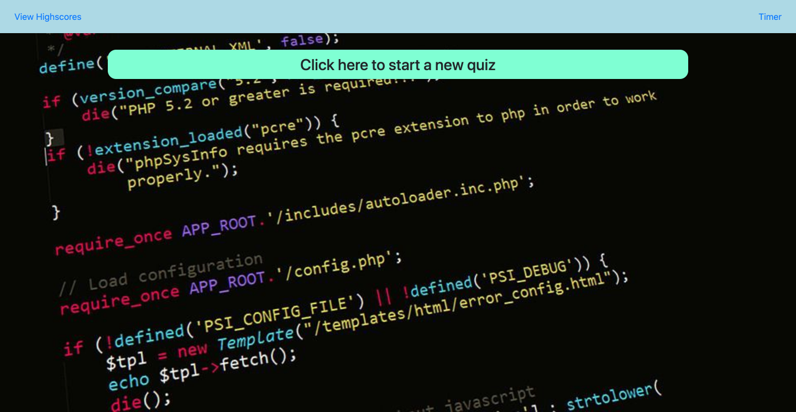
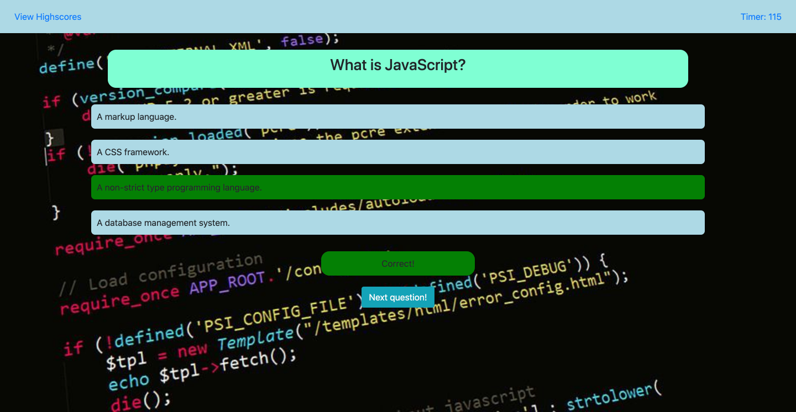
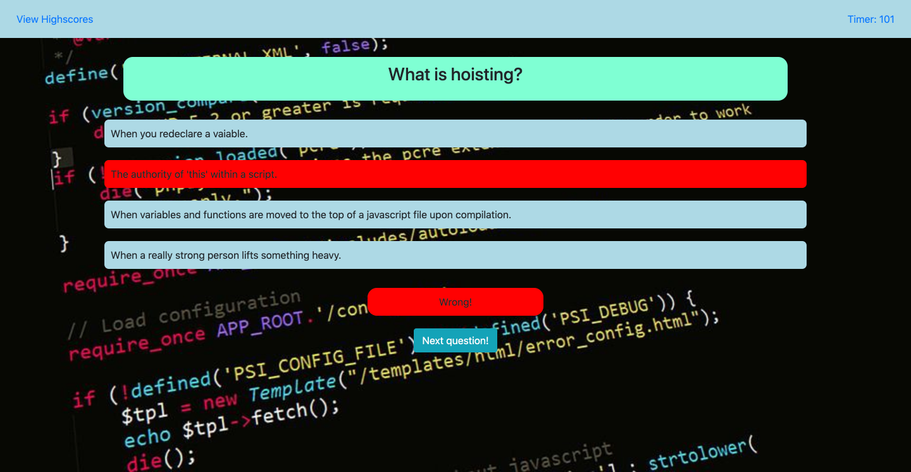
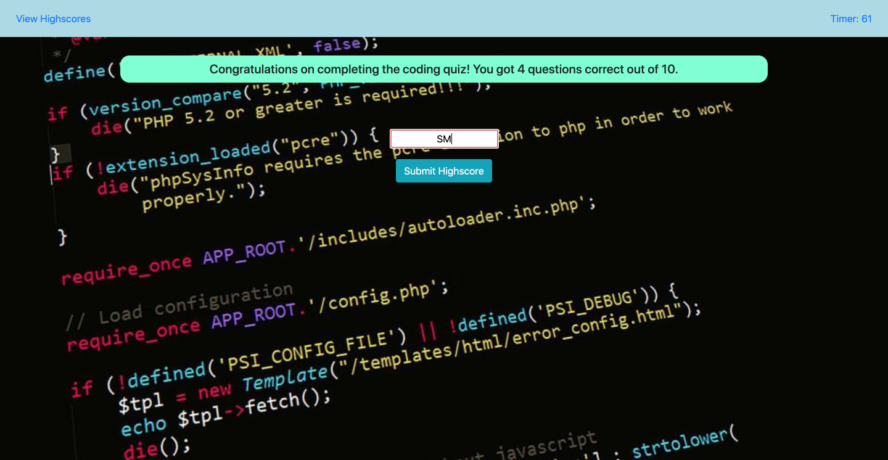
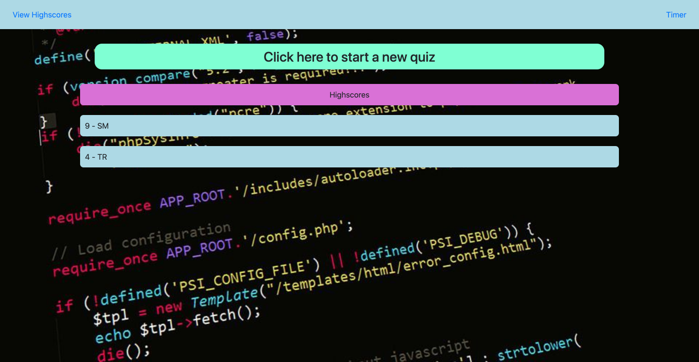

# Coding quiz
This repository contains a unique code quiz. It will test the user's knowledge of JavaScript. This quiz is time and allows users to save their high scores after each attempt.

## Outline of Coding Quiz
This repository has some unique features, which are outlined below:
1. A 10 question quiz that tests a user's in-depth knowledge about Javascript. This quiz lasts 120 seconds. Questions have 4 multiple choice answers and only one correct answer.
2. User's can easily press the start button at the top of the page. Once this occurs they are prompted through each question one at a time.
3. Once the question is answered, if it is correct, it will highlight it green, if wrong it will highlight it red. The user can then click the next question button to proceed to the next question.
4. If a question is answered incorrectly, 5 seconds is deducted from the time. 
5. If the user answers all questions or the time runs out, a page shows how many questions were answered correctly. Users can also input their name and submit it to the highscores page. 
6. After submitting the high score or by clicking "View highscores" in the top left corner, the user is taken to a high score page, where they can see how they stack up to others.

## Github links

[Homework-4 Github Repository](https://github.com/sean-marten/software-quiz)

[Homework-4 Webpage](https://sean-marten.github.io/software-quiz/)

## Images of Webpages

The web page consists of a simple navbar for the highscore navigation. This web page changes dynamically between the start, questions, finish and high score pages. The use of this page is shown in a gif below.

### Webpage at start:

### Webpage question correct:

### Webpage question wrong:

### Webpage at finish:

### Webpage highscores:

